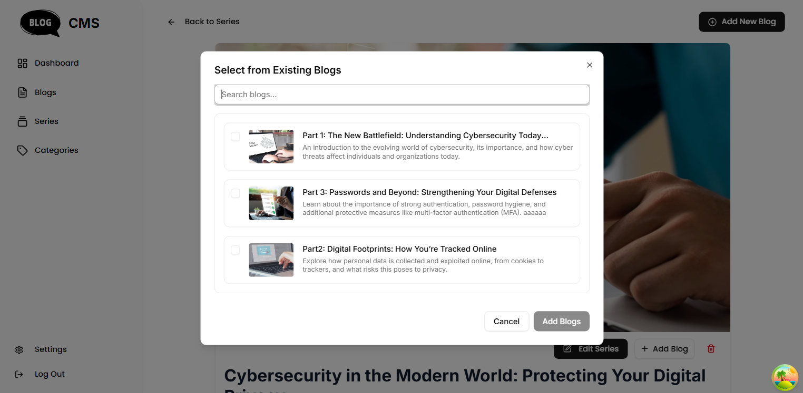

By creating a **blog series**, you can publish related blog posts in multiple parts, helping your readers follow along more easily.

## Steps to Create a New Series

1. Click the **Add New Series** button in the Blogs section.
2. Fill in the necessary details:
   - Series title
   - Description
   - Cover image (recommended **16:9** aspect ratio for best preview)
3. Enable **Publish Series** if you want all blogs within the series to publish automatically.
4. Save the series.

---

## Managing a Series

- After creating the series, you can add or remove individual blogs.
- Update series details any time.
- Delete the series if you no longer need it.

---

> **Tip:** Using series helps you build more engaging, binge-worthy content for your readers.

