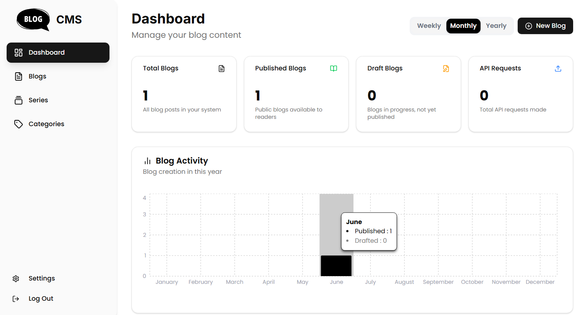

In the **Dashboard**, you will find **analytics** for your blog content creation organized by:

- **Week**
- **Month**
- **Year**

These insights help you track and improve your content performance over time.

> **Tip:** Use these statistics to plan future blog topics that resonate better with your audience.
