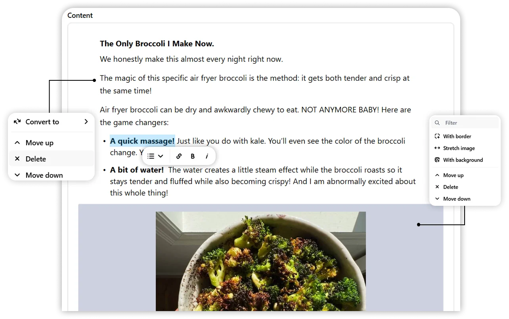

After creating blog posts, you can easily manage them from the **Blogs** section.

---

## Managing Drafts

- Go to the **Drafts** section to view all your saved drafts.
- Click **Edit** on any draft to continue working on it.
- Once finished, you can either **publish** or keep it as a draft for later.

---

## Updating Published Posts

- Navigate to your published posts list.
- Click **Edit** to modify the content blocks, add media, or update metadata.
- After making changes, republish the post to overwrite the live version.
- If needed, you can also revert a published post back to **draft** status.

---

> **Tip:** Use the draft status to temporarily hide posts without permanently deleting them.

---