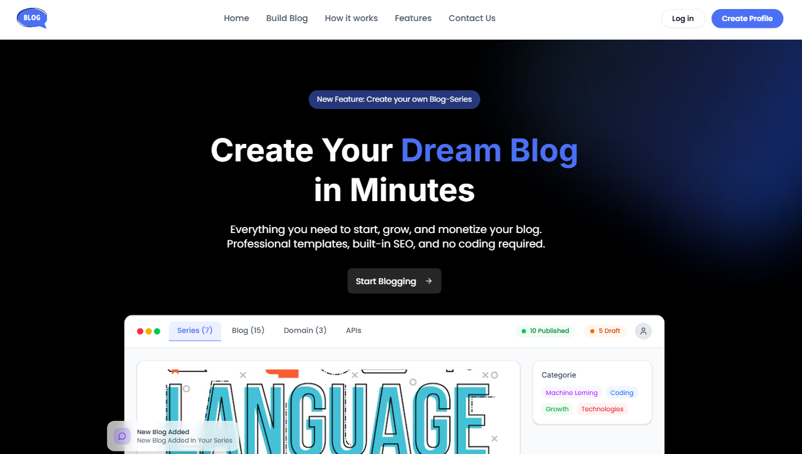

  
**28/06/2025**

### What is Blog - CMS?

Blog CMS is a free, lightweight content management system designed for both developers and writers. It offers: 
- For Writers: An intuitive, Editor.js-based interface that allows easy creation and management of blog content. 
- For Developers: A simple and secure JSON API for integrating blog content into custom front-end applications. 

There are no paywalls or sign-up fees just a fast, no-frills platform that includes: 
- User management for content creators 
- Draft saving and publishing controls 
- API key generation 
- Structured JSON endpoints for seamless content consumption 

This tool is designed to be minimal yet powerful ideal for side projects, personal blogs, or developer documentation sites.

